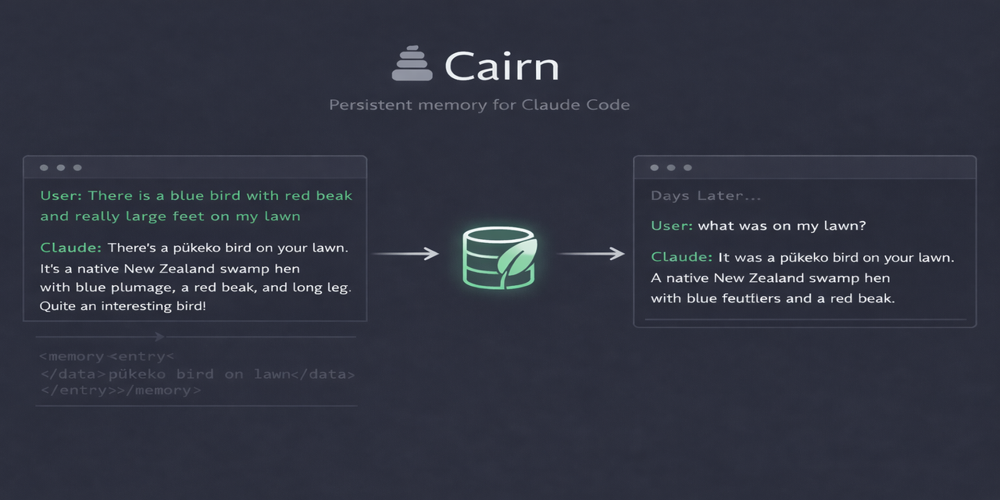

# Cairn

> **cairn** */kɛːn/* — a mound of stones built as a trail marker, placed one at a time by those who pass, so that those who follow can find their way.

[](https://opensource.org/licenses/MIT)
[](https://github.com/jimovonz/cairn/actions/workflows/tests.yml)

<p align="center">
  
</p>

**Every Claude Code response distills what it learned into structured knowledge. The user never sees it. A hook captures it. A database stores it. The next session knows.**

Cairn exploits the gap between raw LLM output and rendered display in **Claude Code** and **VS Code Copilot Chat**. Memory metadata is invisible to the user — angle bracket tags are stripped from the CLI, markdown link definitions don't render in Copilot's chat panel — but preserved in the hook system. This creates an invisible control plane where the LLM distills portable knowledge on every turn, and the infrastructure enforces it mechanically.

No cloud. No API keys. No MCP. One SQLite file. Two hooks. **No additional LLM calls** — knowledge is distilled as part of the normal response, not via a separate extraction step.

---

## What makes this different

Most LLM memory systems treat memory as infrastructure *around* the LLM — capturing at session end, on compaction, via batch tools, or when the LLM calls an explicit tool. Retrieval fires at session start or when the user's prompt happens to match something stored.

Cairn delivers **per-turn granular knowledge capture and retrieval**, making the LLM an active participant in its own memory lifecycle on every single turn:

- **Every response** → the LLM distills what it learned into structured, portable knowledge
- **Every response** → the LLM self-assesses whether it has sufficient context and requests retrieval if not
- **Every response** → keywords are extracted and cross-project knowledge is staged for the next turn

All three are enforced mechanically. The LLM cannot forget to participate. No other memory system operates this way.

**The LLM is the knowledge author — at zero extra cost.** Knowledge is distilled as part of every response, not via a separate LLM call. Other systems run a second Claude invocation after the session to extract memories. Cairn's memory block is invisible tail content appended to the normal response — the same tokens that answer the user also distill the knowledge. No extra API calls, no added latency, no background processes for extraction.

**The knowledge channel is invisible.** The user sees a clean response. The hook infrastructure sees structured entries with type, topic, confidence signals, and retrieval requests. The LLM writes to a channel the user can't see.

**The LLM controls the retrieval loop.** It declares when it lacks context. A Stop hook searches the database, injects results, and re-prompts — all before the response reaches the user. The LLM also rates what it gets back, dynamically adjusting confidence scores that determine what surfaces in future sessions.

**Enforcement is mechanical, not advisory.** A Stop hook fires after every response. No memory block? Blocked and re-prompted. Says it's incomplete? Blocked and continued. Needs context? Blocked, searched, injected, continued. The LLM can't forget to participate.

### How it compares

Surveyed the top 30 GitHub "claude memory" repos (April 2026) plus the two most prominent dedicated memory systems (Claude-Mem, Mem0). The landscape breaks into four approaches:

| Approach | Examples | Limitation |
|----------|----------|------------|
| File-based / markdown | claude-memory-engine, claude-memory-extractor | No semantic search, no dedup, no retrieval loop |
| Session-end capture | claude-memory-plugin, claude-mem | Memory extracted after the session; requires extra LLM calls |
| SDK / API layer | Mem0 | Requires 2+ extra LLM calls per add(); no Claude Code hook integration |
| MCP tool-call | claude-memory-mcp, claude_memory | LLM must explicitly invoke retrieval; passive otherwise |

Cairn is the only system that makes the LLM an active participant on every turn with zero extra LLM calls:

| Capability | Cairn | Claude-Mem | Mem0 | Others |
|------------|-------|-----------|------|--------|
| Knowledge distilled within the normal response — **no extra LLM calls** | ✓ | ✗ (1 call/session) | ✗ (2+ calls/add) | ✗ |
| LLM self-declares context gaps mid-conversation, system injects and re-prompts | ✓ | ✗ | ✗ | ✗ |
| Automatic context injection — no explicit tool call required | ✓ | ✗ | ✗ | ✗ |
| Bootstrap enforcement — forces context checks every N turns | ✓ | ✗ | ✗ | ✗ |
| Completeness enforcement — blocks stop if LLM says it's not done | ✓ | ✗ | ✗ | ✗ |
| Veracity feedback loop — `+`/`-!` annotations across sessions | ✓ | ✗ | ✗ | ✗ |
| Verbatim session recovery — retrieves actual transcript excerpt, not a summary | ✓ | partial | ✗ | ✗ |
| Correction-file association — corrections auto-linked to files at time of mistake | ✓ | ✗ | ✗ | ✗ |
| Structured memory taxonomy (decision/correction/fact/etc.) enforced at write time | ✓ | ✗ | ✗ | ✗ |
| Trailing intent detection — blocks stop if LLM promised action without doing it | ✓ | ✗ | ✗ | ✗ |
| Hybrid FTS5 + vector search with RRF | ✓ | ✗ | ✗ | one |
| Cloud-free, no external dependencies | ✓ | ✓ | optional | most |

**Session 1** — casual conversation in `~/temp`:
```
You:    "I see a fairly big mostly blue bird on my lawn. Solid red beak and huge feet"
Claude: "That's a pukeko — NZ Purple Swamphen..."
```

**Session 2** — different directory, days later, working on something unrelated:
```
You:    "what was on my lawn?"
Claude: "A pukeko — NZ Purple Swamphen. Large blue bird, red beak, big feet."
```

The user never asked Claude to remember the bird. Never asked it to look anything up. The memory was captured invisibly in session 1 and surfaced automatically in session 2.

## Features

- **Cross-session memory** — decisions, preferences, facts, corrections, people, projects, skills, workflows
- **Per-turn memory authoring** — the LLM writes structured memories on every response, enforced mechanically; no separate capture step
- **Per-turn context self-assessment** — the LLM declares when it lacks context on every response; the system retrieves and re-prompts automatically
- **Five retrieval layers** — CWD-based project bootstrap, proactive first-prompt push, per-prompt mid-session injection, cross-project keyword surfacing, LLM-requested pull, plus gotcha injection on file access
- **Hybrid FTS5 + vector search with RRF** — exact keyword matches (error codes, function names) fused with semantic similarity via Reciprocal Rank Fusion; dual-method matches ranked higher than single-method
- **Type-prefix fan-out** — query expansion that searches with each memory type prefix (fact, decision, correction, etc.) and takes the max similarity per memory; closes the embedding gap between bare queries and type-prefixed stored memories
- **Veracity tracking** — confidence represents corroboration, not retrieval rank; `+` corroborates, `-!` annotates contradictions with reasons that persist for future sessions
- **Cross-encoder re-ranking** — after diversity filtering, a cross-encoder (`ms-marco-MiniLM-L-6-v2`) jointly scores (query, memory) pairs, catching semantic relationships that independent embeddings miss; blended with composite score at configurable weight
- **Memory consolidation** — automated pipeline merges duplicate memories using NLI entailment scoring, with Haiku generating consolidated entries; runs daily via cron
- **Contradiction detection** — NLI-based contradiction scoring with Haiku assessment identifies superseded memories and auto-archives them; incremental via pair assessment cache
- **Semantic search** — local embeddings via `all-MiniLM-L6-v2` with sqlite-vec indexed vector search; no API key required
- **Project bootstrap** — on session start, injects standing-context memories (preferences, facts, project state) for the current working directory; gives Claude project awareness from CWD alone, independent of prompt content
- **Per-prompt context injection** — on every subsequent prompt, searches for relevant past context mid-conversation; catches cases where relevant memories exist but the LLM didn't know to ask
- **Project scoping** — memories auto-labelled by working directory, retrievable per-project or globally
- **Invisible** — metadata tags are stripped from user display; the system operates transparently
- **Quality gates** — 10 configurable filters including garbage, borderline, relative, dominance, diversity, and cross-encoder re-ranking
- **Contradiction handling** — same-topic updates suppress the old entry; negation heuristics dampen conflicting memories; `-!` annotations preserve why something was wrong
- **Correction-file association** — when a correction is stored, surrounding file paths are automatically extracted from the transcript and linked; future access to those files injects the correction proactively
- **Gotcha injection** — PreToolUse hook surfaces corrections and relevant context before Read/Edit/Write tool calls on associated files
- **Dual-platform support** — works with both Claude Code CLI (`<memory>` tags, stripped from terminal) and VS Code Copilot Chat (`[cm]:` markdown link definitions, invisible in chat panel); transcript adapter normalizes both formats transparently
- **Compact memory format** — dual-format parser supports both verbose (`- type: fact`) and compact (`fact/topic: content [k: kw1, kw2]`) memory blocks
- **Completeness enforcement** — `complete: false` blocks stop and re-prompts with remaining work; trailing intent detection blocks when the LLM promises action without following through
- **Bootstrap enforcement** — forces context checks every N turns to build the habit of cairn-first reasoning
- **Active bootstrap trigger** — pattern-based detection of knowledge questions ("what did we decide", "remind me about", "what aspect of my X") fires an immediate context check, not just on the N-turn timer
- **Thin-retrieval escalation** — when push retrieval returns too few or too-weak results, the next stop hook stages a reminder forcing the LLM to run `query.py` directly or re-declare with a refined need; catches the failure mode where the LLM trusts an empty push as authoritative absence
- **Query-quality enforcement** — detects phoned-in `context_need` declarations that don't reference the substantive terms from the user's question; staged reminder asks for a refined declaration
- **Multi-query decomposition** — `|` separator in `find_similar` and `query.py --semantic` runs each subquery independently and merges by best score; tight semantic vectors per topic instead of one blurred embedding
- **Type-aware scope bias** — `person` and `preference` memory types ignore the project scope penalty so biographical/cross-cutting facts about the user surface in any session, not just the project where they were captured
- **Project label override** — `CAIRN_PROJECT=name claude` overrides the cwd-based default for catch-all directories or benchmark isolation
- **Verbatim session recovery** — every memory links back to the exact conversation that produced it; `--context <id>` retrieves the verbatim transcript excerpt from the original session — the actual words spoken, not a summary or reconstruction. No other surveyed system provides this.
- **Self-improving** — retrieval outcome feedback adaptively tightens thresholds when results are poor
- **Memory audit** — `/cairn audit` reviews session memories for accuracy, enriches thin entries, fills gaps; background agent (`audit_agent.py`) reads transcripts via `claude -p` for automated review
- **Archive over delete** — superseded and incorrect memories are archived with reasons, preserving the learning trail of rejected approaches and mistakes
- **Content enforcement** — strict metadata validation, content density checks, anti-fabrication rules
- **Health check** — `--check` validates the full chain (DB, hooks, daemon, embeddings, rules) post-install
- **Self-healing embeddings** — auto-starts daemon and backfills when memories are stored without embeddings
- **Web dashboard** — browser-based UI at `localhost:8420` for monitoring and management; overview stats, memory browser with search, session explorer with transcript viewer, retrieval metrics, embedding performance, token usage estimates, per-session generated-vs-consumed memory flow, config editor
- **Subagent mode** — automatic detection via `agent_id` in hook input; keeps bootstrap + L1 context injection, skips enforcement/L1.5/L2; stop hook opportunistically stores volunteered memories without blocking
- **Embedding instrumentation** — per-call timing for daemon, local model, vector search, brute-force search, and fan-out expansion; surfaced in dashboard metrics panel
- **Env var overrides** — any config value tunable via `CAIRN_<NAME>=value` without editing source

## Quick start

```bash
git clone https://github.com/jimovonz/cairn.git ~/cairn
cd ~/cairn
./install.sh            # CPU embeddings (default, ~200MB PyTorch)
./install.sh --gpu      # GPU embeddings (CUDA, ~2.3GB PyTorch)
```

Restart Claude Code (or VS Code with Copilot). The system is now active in every session.

The installer:
1. Creates a Python venv and installs dependencies (CPU-only PyTorch by default)
2. Initializes the SQLite database
3. Deploys global hooks, instructions, and the `/cairn` slash command
4. Downloads 3 models (~250MB total, one-time): embedding (`all-MiniLM-L6-v2`), cross-encoder (`ms-marco-MiniLM-L-6-v2`), NLI (`nli-MiniLM2-L6-H768`)
5. Starts the embedding daemon
6. Installs daily cron jobs for memory consolidation (3:00 AM) and contradiction detection (3:30 AM)

## Usage

The system works automatically. No manual action required.

Every Claude Code response produces invisible metadata that gets captured and stored. When the LLM needs past context, it requests it and the system injects relevant memories with project scoping, confidence scores, and recency weighting.

### Slash commands

| Command | Description |
|---------|-------------|
| `/cairn` | Memory stats, confidence distribution, drift indicators |
| `/cairn recent` | Recently stored memories |
| `/cairn projects` | List all projects with memory counts |
| `/cairn project <name>` | All memories for a project |
| `/cairn search <term>` | Full-text search |
| `/cairn semantic <query>` | Semantic similarity search |
| `/cairn audit` | Review session memories — confirm, enrich, archive, fill gaps |
| `/cairn audit-bg` | Background audit via `claude -p` agent with transcript |
| `/cairn review` | Surface low-confidence and suppressed memories |
| `/cairn context <id>` | Recover verbatim transcript excerpt from the session where this memory was created |
| `/cairn history <id>` | Version history for a memory |
| `/cairn check` | Validate system health (DB, hooks, daemon, embeddings) |
| `/cairn compact [project]` | Dense dump suitable for LLM ingestion |
| `/cairn verify` | Source indexing coverage report |
| `/cairn backfill` | Generate embeddings for memories stored without daemon |
| `/cairn delete <id>` | Delete a memory |
| `/cairn daemon start\|stop\|status` | Manage the embedding daemon |
| `/cairn dashboard` | Launch web dashboard in browser |

## How it works

### The invisible metadata mechanism

Every LLM response ends with a `<memory>` block using angle bracket tags. Claude Code strips these from the displayed output — the user sees a clean response. But the Stop hook has full access to the structured data.

```
<memory>
- type: decision
- topic: auth-approach
- content: Use JWT for stateless auth, no server sessions
- keywords: authentication, JWT, session
- source_messages: 15-22
- complete: true
</memory>
```

### Five retrieval layers

| Layer | When | What |
|-------|------|------|
| **First-prompt push** | First message of session | Proactively injects relevant context before the LLM starts generating |
| **Keyword cross-project** | Between turns | Surfaces global knowledge based on topic keywords from the current conversation |
| **Pull-based** | When LLM identifies a gap | LLM declares `context: insufficient`, hook searches and injects |
| **Bootstrapping** | Every N turns without pull | Forces a `context: insufficient` declaration to build the habit |
| **Gotcha injection** | Before Read/Edit/Write tool calls | PreToolUse hook surfaces corrections linked to the file being accessed |

### Veracity system

Confidence represents **veracity** — how well-corroborated a memory is across sessions. It is *not* used in retrieval scoring (similarity, recency, and scope handle ranking).

- `+` → corroboration: `confidence += 0.1 × (1 - confidence)` — saturating boost
- `-` → irrelevant: no change (irrelevance is not evidence against truth)
- `-! reason` → contradiction: annotates the memory with a reason it's wrong, preserved for future sessions

Memories start at 0.7 (unverified). No passive decay — important but rarely accessed memories retain their confidence indefinitely.

### Quality gates

Retrieved results pass through 10 configurable gates before injection:

1. Low-information pre-filter (skip generic queries)
2. Garbage gate (reject if best similarity < 0.35)
3. Borderline gate (reject weak similarity + low score)
4. Adaptive threshold (auto-tighten if recent retrievals were poor)
5. Relative filter (drop entries far below the best match)
6. Diversity filter (deduplicate near-identical results)
7. Cross-encoder re-ranking (joint query-memory scoring with score floor)
8. Dominance suppression (include runner-up if close to leader)
9. Weak-entry suppression (don't inject if top result is unreliable)
10. Hard cap (max 5 entries)

All thresholds configurable in `cairn/config.py`.

## Architecture

See [ARCHITECTURE.md](ARCHITECTURE.md) for the full technical reference (600+ lines), including:

- Database schema (memories, sessions, history, metrics)
- Composite scoring formula
- Deduplication and contradiction handling
- Embedding strategy and vector search
- Loop protection mechanisms
- Design decisions and rationale

## File structure

```
cairn/
├── install.sh              # One-command installer
├── uninstall.sh            # Clean removal
├── pyproject.toml          # Package metadata and dependencies
├── CLAUDE.md               # Project-local LLM instructions
├── .claude/
│   ├── settings.json       # Project-local hooks
│   └── rules/
│       └── memory-system.md  # Full system rules for the LLM
├── cairn/
│   ├── config.py           # All tunable parameters (env var overrides)
│   ├── init_db.py          # Schema and migrations
│   ├── query.py            # CLI query tool (20+ commands)
│   ├── dashboard.py        # Web dashboard (localhost:8420)
│   ├── embeddings.py       # Embedding with daemon support + composite scoring
│   ├── daemon.py           # Background server (embeddings, cross-encoder, NLI)
│   ├── consolidate.py      # Memory consolidation + contradiction detection pipeline
│   ├── contradiction_scan.py # Legacy contradiction scanner
│   ├── benchmark_extract.py # Retrieval benchmark dataset extraction
│   └── static/
│       └── index.html      # Dashboard single-page UI
├── logs/                   # Cron job output (consolidation, contradiction)
├── hooks/
│   ├── stop_hook.py        # Orchestrator: session, parsing, routing
│   ├── prompt_hook.py      # Layer 1 + Layer 1.5 + Layer 2 injection
│   ├── hook_helpers.py     # Shared DB access, logging, metrics
│   ├── parser.py           # Memory block parsing (ParseResult NamedTuple)
│   ├── storage.py          # Insert, dedup, confidence, quality gates
│   ├── enforcement.py      # Trailing intent detection, continuation counting
│   ├── retrieval.py        # Context retrieval with RRF fusion, Layer 2, context cache
│   ├── query_expansion.py  # Type-prefix fan-out for broader recall
│   ├── pretool_hook.py     # PreToolUse hook — gotcha injection on file access
│   └── hash_verify.py      # Response hash verification (log-only, non-blocking)
└── templates/              # Installer templates for global config
```

## Requirements

- [Claude Code](https://claude.com/claude-code) v2.1+
- Python 3.10+
- ~1.5GB disk (3 models + venv)
- ~500MB download on first install (PyTorch CPU + sentence-transformers + 3 models; ~2.5GB with `--gpu`)
- ~500MB RAM (when embedding daemon is running; auto-shuts down after 30min idle)

**Platform:** Developed and tested on Ubuntu 22.04. Linux and macOS should work. Windows requires WSL — the installer is bash, and the embedding daemon uses Unix sockets. The core hooks work without the daemon (slower embedding, no daemon acceleration) but `install.sh` must run in a Unix shell.

**Concurrency:** Safe for multiple simultaneous Claude Code sessions, cron jobs, and external integrations. SQLite runs in WAL mode with a 5-second busy timeout — concurrent readers with queued writers.

## Configuration

All tunable parameters are in `cairn/config.py`. Any value can be overridden via environment variable: `CAIRN_<NAME>=value` (e.g. `CAIRN_DEDUP_THRESHOLD=0.90`).

- Retrieval thresholds per layer
- Composite scoring weights
- Confidence boost/penalty rates
- Quality gate thresholds
- Deduplication sensitivity
- Cross-encoder re-ranking (`CROSS_ENCODER_ENABLED`, `CROSS_ENCODER_WEIGHT`, `CROSS_ENCODER_SCORE_FLOOR`)
- NLI consolidation/contradiction (`NLI_ENABLED`, `NLI_ENTAILMENT_THRESHOLD`, `NLI_CONTRADICTION_THRESHOLD`)
- Consolidation clustering (`CONSOLIDATION_SIMILARITY_THRESHOLD`, `CONSOLIDATION_MIN_CLUSTER_SIZE`)
- Query expansion (`QUERY_EXPANSION_FANOUT` — type-prefix fan-out, default on)
- Trailing intent detection threshold
- Loop protection limits

## Key design decisions

| Decision | Rationale |
|----------|-----------|
| **No MCP** | Claude Code has direct filesystem access — MCP adds a protocol layer for capabilities already available natively |
| **Pull-based retrieval** | The LLM decides when it needs context — more token-efficient than injecting on every prompt |
| **Local models** | No API keys, no network latency, no ongoing costs. 3 local models: embedding, cross-encoder re-ranking, NLI for consolidation |
| **Veracity over ranking** | Confidence tracks corroboration, not retrieval relevance — similarity and recency handle ranking |
| **Invisible tags** | User sees clean output; hook infrastructure sees structured metadata — no UX compromise |
| **sqlite-vec** | Indexed vector KNN search that scales, with transparent brute-force fallback |
| **WAL + busy timeout** | Concurrent sessions, cron, and external integrations without "database locked" errors |

## Limitations

**Claude Code only.** Cairn is tightly coupled to Claude Code's hook system and tag-stripping behaviour. It will not work with Cursor, VS Code agents, other LLMs, or the Claude web interface. This is by design — the architecture exploits Claude Code's specific capabilities rather than targeting a lowest common denominator.

**LLM cooperation is imperfect.** The system depends on the LLM reliably producing well-formed `<memory>` blocks and accurately declaring when it needs context. In practice, the LLM sometimes answers "I don't know" before the hook can inject memories, or produces generic memories instead of extracting specific facts. Mechanical enforcement (the Stop hook) catches most failures but adds a re-prompt turn when it does.

**Tag invisibility is behaviour-dependent.** The invisible metadata relies on Claude Code stripping angle bracket tags from rendered output. If Anthropic changes this rendering behaviour, memory blocks would become visible to users. The system would still function but the clean UX would degrade.

**Distillation is lossy.** Memories are one-line summaries. The `--context` command can recover the full conversation around any memory, but only while Claude Code retains the transcript file. Claude Code's `cleanupPeriodDays` setting (default 30) controls how long transcripts are kept — increase it if you need longer context recovery. After cleanup, the one-line summary persists permanently.

**Early stage.** Limited cross-platform testing — may have edge cases around permissions, venv conflicts, or long-running daemon stability. Bug reports welcome.

## Failure modes

Things that can go wrong and how the system handles them:

| Failure | What happens | Mitigation |
|---------|-------------|------------|
| LLM forgets the `<memory>` block | Stop hook blocks the response and re-prompts "add a memory block" | User sees a brief pause; the re-prompt is invisible |
| LLM answers before checking memory | User sees "I don't know" then a correction after the hook injects context | Layer 1 (first-prompt push) proactively injects on the first message to prevent this |
| Embedding daemon not running | Memories stored without embeddings; dedup and semantic search degraded | Auto-start attempted; background backfill triggers automatically when missing embeddings detected |
| Hook crashes | Fail-open design: crash → exit 0 → response reaches user normally | Crash logged to metrics; no user impact |
| Retrieval returns irrelevant context | 8 quality gates filter noise; adaptive thresholds tighten if outcomes are poor | LLM can rate retrieval as `harmful`, raising thresholds automatically |
| Infinite re-prompt loop | Continuation cap (max 3) forces a stop after 3 consecutive re-prompts | Context cache prevents same query being served twice |
| Contradictory memories | Same type+topic overwrites with confidence suppression; NLI-based contradiction detection auto-archives superseded memories daily | Old content preserved in version history; daily cron catches cross-type contradictions |
| Database grows large | sqlite-vec provides indexed vector search; brute-force fallback for small DBs | All quality gates reduce injected volume regardless of DB size |

## Contributing

See [CONTRIBUTING.md](CONTRIBUTING.md). Bug fixes, retrieval improvements, test coverage, and platform compatibility contributions are especially welcome.

## Testing

572 tests across 33 test files. Most tests use mock vectors and patched DB paths — no embedding model required. Quality benchmarks (`test_retrieval_quality*.py`, `test_query_expansion.py`) use real embeddings for ground-truth validation and skip gracefully in CI.

```bash
cd ~/cairn
python3 -m pytest tests/
```

| Test file | Tests | What it covers |
|-----------|------:|---------------|
| `test_parser.py` | 18 | Memory block parsing: valid, malformed, unclosed tags, code fences, compact format |
| `test_parser_stranded.py` | 22 | Parser edge cases: 4-strand format, adversarial inputs |
| `test_scoring.py` | 20 | Composite scoring, recency decay, veracity dynamics through real DB, negation heuristics |
| `test_gates.py` | 20 | Quality gates through find_similar, garbage/diversity filtering, boundary conditions |
| `test_integration.py` | 12 | Full pipeline with in-memory DB: insert → dedup → retrieve → gate |
| `test_stop_hook.py` | 34 | Stop hook main(): register_session, auto_label_project, storage, blocking, metrics |
| `test_hook_e2e.py` | 16 | Stop hook main() with patched stdin: storage, blocking, sessions, metrics |
| `test_prompt_hook.py` | 24 | Layer 1/1.5/2: first-prompt detection, per-prompt injection, staged context |
| `test_project_bootstrap.py` | 8 | CWD-based project bootstrap: standing context injection, type filtering, archived exclusion |
| `test_pretool_hook.py` | 8 | PreToolUse gotcha injection: find_memories_for_file and main() |
| `test_storage.py` | 12 | Memory storage, deduplication, confidence updates, quality gates |
| `test_daemon_and_cache.py` | 14 | Daemon fallback, context cache, loop protection, fail-open, pre-filter |
| `test_query_cli.py` | 8 | CLI commands: search, stats, review, delete, history, compact, projects |
| `test_query.py` | 14 | Query functions: search, semantic, context recovery, backfill, stats |
| `test_query_functions.py` | 68 | Query module internals: date parsing, formatting, project listing, chain traversal |
| `test_semantic_search.py` | 7 | Semantic search pipeline: embedding, similarity, ranking, scope filtering |
| `test_retrieval_pipeline.py` | 40 | Retrieval pipeline: dedup, contradictions, variants, adaptive thresholds, Layer 2 |
| `test_retrieval_hooks.py` | 28 | retrieve_context, layer2_cross_project_search, adaptive thresholds, context cache |
| `test_retrieve_context.py` | 8 | retrieve_context RRF fusion, thresholds, XML output |
| `test_retrieve_context_rrf.py` | 4 | RRF fusion: dual-match ranking, same-session exclusion, score paths |
| `test_retrieve_context_rrf2.py` | 4 | RRF fusion: additional coverage |
| `test_rrf_and_gotcha.py` | 25 | RRF fusion, correction-file association, PreToolUse gotcha injection |
| `test_hash_verify.py` | 15 | Response hash computation and verification |
| `test_enforcement_loop.py` | 22 | Two-pass enforcement loop, continuation cap, context cache, write throttle |
| `test_question_enforcement.py` | 7 | Question-before-cairn detection and enforcement |
| `test_trailing_intent.py` | 24 | Trailing intent detection, intent: resolved escape, content quality gate |
| `test_e2e_pipeline.py` | 14 | Full round-trip through all 5 layers + gotcha: prompt → stop → prompt |
| `test_install_validation.py` | 21 | Installation validation: DB schema, templates, settings merge, health check |
| `test_live_hooks.py` | 1 | Live integration: real prompt through claude -p, verifies hook pipeline |
| `test_retrieval_benchmark.py` | 17 | Latency regression: FTS5/vector/RRF at 100/500/1000 scale, scaling curves |
| `test_retrieval_quality.py` | 13 | Retrieval quality (easy): ground-truth P/R/MRR across 5 clean clusters |
| `test_retrieval_quality_hard.py` | 12 | Retrieval quality (hard): overlapping clusters, distractors, graded difficulty |
| `test_query_expansion.py` | 9 | Query expansion: type-prefix fan-out, corpus PRF, neighbor blend, combined |

## License

[MIT](LICENSE)
