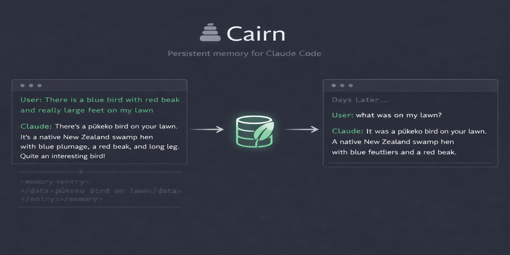

# Cairn

> **cairn** */kɛːn/* — a mound of stones built as a trail marker, placed one at a time by those who pass, so that those who follow can find their way.

[](https://opensource.org/licenses/MIT)
[](https://github.com/jimovonz/cairn/actions/workflows/tests.yml)

<p align="center">
  
</p>

Each Claude Code response ends with a short structured block describing what the turn established. The user never sees it: a hook parses it out, stores it in SQLite, and injects relevant entries into later sessions.

An opt-out local API proxy sits between Claude Code and the Anthropic API: it strips every Cairn artifact (`[cm]` blocks, `<cairn_context>`, system reminders) from the response stream server-side and re-injects context into the next request, so the prompt cache stays byte-exact and the user never sees the control channel. Without the proxy, Cairn falls back to relying on rendering quirks — angle bracket tags are stripped from the Claude Code CLI, markdown link definitions don't render in Copilot's chat panel — but the proxy is the durable mechanism.

No cloud. No API keys. No MCP. One SQLite file. Five hook types (Stop, UserPromptSubmit, PreToolUse, PostToolUse, SubagentStop). **No additional LLM calls** — knowledge is distilled as part of the normal response, not via a separate extraction step.

---

## Approach

Most LLM memory systems treat memory as infrastructure *around* the LLM — capturing at session end, on compaction, via batch tools, or when the LLM calls an explicit tool. Retrieval fires at session start or when the user's prompt happens to match something stored.

Cairn moves that work into the turn itself. On every response the model:

- distills what the turn established into structured, portable knowledge
- self-assesses whether it has sufficient context, and requests retrieval if not
- emits keywords, which stage cross-project knowledge for the next turn

All three are enforced by hooks rather than requested in a prompt, so participation does not depend on the model remembering to opt in.

**The model authors the knowledge inside its reply.** Knowledge is distilled as part of every response rather than by a separate LLM call afterwards. Cairn's memory block is invisible tail content appended to the normal response — the same tokens that answer the user also distill the knowledge. No extra API calls, no added latency, no background processes for extraction.

**The knowledge channel is invisible.** The user sees a clean response. The hook infrastructure sees structured entries with type, topic, confidence signals, and retrieval requests. The LLM writes to a channel the user can't see.

**The LLM controls the retrieval loop.** It declares when it lacks context. A Stop hook searches the database, injects results, and re-prompts — all before the response reaches the user. The LLM also rates what it gets back — corroborating, flagging irrelevance, or annotating contradictions — building a veracity signal across sessions.

**Enforcement is mechanical.** A Stop hook fires after every response. No memory block? Blocked and re-prompted. Says it's incomplete? Blocked and continued. Needs context? Blocked, searched, injected, continued. The LLM can't forget to participate.

### Related approaches

A review of the top 30 GitHub "claude memory" repos (April 2026) plus Claude-Mem
and Mem0 found four recurring designs, each with different tradeoffs:

| Approach | Examples | Capture point |
|----------|----------|---------------|
| File-based / markdown | claude-memory-engine, claude-memory-extractor | Written to files; retrieval by file read |
| Session-end capture | claude-memory-plugin, claude-mem | Extracted after the session, in a separate pass |
| SDK / API layer | Mem0 | Extraction calls made by the host application |
| MCP tool-call | claude-memory-mcp, claude_memory | When the model chooses to invoke the tool |

Cairn sits in a different spot on that axis: it captures on every turn, because
the memory block is tail content of the reply the model is already writing, so
there is no second pass to pay for. The tradeoff is that it depends on the model
emitting a well-formed block, which is why a hook checks for one and re-prompts
when it is missing.

Whether per-turn capture is worth that coupling depends on the workload. For
long-running work in one codebase it has been worth it here; for occasional
one-shot sessions the simpler designs above are likely a better fit.

Everything else Cairn does — hybrid FTS5 + vector search, a veracity feedback
loop, structured memory types, verbatim transcript recovery — exists elsewhere in
some form, and is a matter of degree rather than kind.

Scope of the review: the top 30 GitHub "claude memory" repos as of **April
2026**, plus Claude-Mem and Mem0. It was a documentation review, not a hands-on
benchmark, and projects move fast — treat the table as a rough map, not a
current scorecard.

**Session 1** — casual conversation in `~/temp`:
```
You:    "I see a fairly big mostly blue bird on my lawn. Solid red beak and huge feet"
Claude: "That's a pukeko — NZ Purple Swamphen..."
```

**Session 2** — different directory, days later, working on something unrelated:
```
You:    "what was on my lawn?"
Claude: "A pukeko — NZ Purple Swamphen. Large blue bird, red beak, big feet."
```

The user never asked Claude to remember the bird. Never asked it to look anything up. The memory was captured invisibly in session 1 and surfaced automatically in session 2.

## Features

### Capture

- **Per-turn memory authoring** — the LLM writes structured memories on every response, enforced mechanically; no separate capture step
- **Per-turn context self-assessment** — the LLM declares when it lacks context on every response; the system retrieves and re-prompts automatically
- **Compact memory format** — dual-format parser supports both verbose (`- type: fact`) and compact (`fact/topic: content [k: kw1, kw2]`) memory blocks
- **Completeness enforcement** — `complete: false` blocks stop and re-prompts with remaining work; trailing intent detection blocks when the LLM promises action without following through
- **Content enforcement** — strict metadata validation, content density checks, anti-fabrication rules
- **Correction-file association** — when a correction is stored, surrounding file paths are automatically extracted from the transcript and linked; future access to those files injects the correction proactively
- **Session handoff digest** — every 10 turns the LLM emits a structured session summary (branch, in-progress work, decisions, blockers, next action) as a project memory; the next session resumes from it via project bootstrap
- **Subagent mode** — automatic detection via `agent_id` in hook input; keeps bootstrap + L1 context injection, skips enforcement/L1.5/L2; stop hook opportunistically stores volunteered memories without blocking
- **Subagent memory capture** — a `SubagentStop` hook routes a subagent's final `[cm]` block (invisible to the parent `Stop` hook) into storage, chained to the parent session, enforcement skipped

### Retrieval

- **Five retrieval layers** — CWD-based project bootstrap, proactive first-prompt push, per-prompt mid-session injection, cross-project keyword surfacing, LLM-requested pull, plus gotcha injection on file access; a same-session gate withholds memories whose originating turn is still in context
- **Project bootstrap** — on session start, injects standing-context memories (preferences, facts, project state) for the current working directory; gives Claude project awareness from CWD alone, independent of prompt content
- **Per-prompt context injection** — on every subsequent prompt, searches for relevant past context mid-conversation; catches cases where relevant memories exist but the LLM didn't know to ask
- **Gotcha injection** — PreToolUse hook surfaces corrections and relevant context before Read/Edit/Write tool calls on associated files
- **Hybrid FTS5 + vector search with RRF** — exact keyword matches (error codes, function names) fused with semantic similarity via Reciprocal Rank Fusion; dual-method matches ranked higher than single-method
- **Semantic search** — local embeddings via `all-MiniLM-L6-v2` with sqlite-vec indexed vector search; no API key required
- **Type-prefix fan-out** — query expansion that searches with each memory type prefix (fact, decision, correction, etc.) and takes the max similarity per memory; closes the embedding gap between bare queries and type-prefixed stored memories
- **Multi-query decomposition** — `|` separator in `find_similar` and `query.py --semantic` runs each subquery independently and merges by best score; tight semantic vectors per topic instead of one blurred embedding
- **Cross-encoder re-ranking** — after diversity filtering, a cross-encoder (`ms-marco-MiniLM-L-6-v2`) jointly scores (query, memory) pairs, catching semantic relationships that independent embeddings miss; blended with composite score at configurable weight
- **GPU-aware reranker** — the cross-encoder defaults to `ms-marco-MiniLM-L-6-v2` (logit floor −3.0) on every device; when `RERANKER_BGE_ENABLED` is set and CUDA is present it swaps to `BAAI/bge-reranker-base` (sigmoid floor **0.015**, recalibrated from Opus grade labels) on a GPU with at least `RERANKER_MIN_VRAM_GB` (6 GB). The daemon owns the model so the hot hook path never imports torch; the cross-encoder scores a cleaned recent-context window, not the bare prompt
- **Quality gates** — 10 configurable filters including garbage, borderline, relative, dominance, diversity, and cross-encoder re-ranking
- **Type-aware scope bias** — `person` and `preference` memory types ignore the project scope penalty so biographical/cross-cutting facts about the user surface in any session, not just the project where they were captured
- **Self-improving** — retrieval outcome feedback adaptively tightens thresholds when results are poor

### Retrieval enforcement

- **Bootstrap enforcement** — forces context checks every N turns to build the habit of cairn-first reasoning
- **Active bootstrap trigger** — pattern-based detection of knowledge questions ("what did we decide", "remind me about", "what aspect of my X") fires an immediate context check, not just on the N-turn timer
- **Thin-retrieval escalation** — when push retrieval returns too few or too-weak results, the next stop hook stages a reminder forcing the LLM to run `query.py` directly or re-declare with a refined need; catches the failure mode where the LLM trusts an empty push as authoritative absence
- **Query-quality enforcement** — detects phoned-in `context_need` declarations that don't reference the substantive terms from the user's question; staged reminder asks for a refined declaration

### Keeping memories true

- **Veracity tracking** — confidence represents corroboration, not retrieval rank; `+` corroborates, `-!` annotates contradictions with reasons that persist for future sessions
- **Contradiction handling** — same-topic updates suppress the old entry; negation heuristics dampen conflicting memories; `-!` annotations preserve why something was wrong
- **Contradiction detection** — NLI-based contradiction scoring with Haiku assessment identifies superseded memories and auto-archives them; also detects plan→implementation pairs (older intent confirmed built by a newer memory) and archives the stale plan as EXECUTED; incremental via pair assessment cache
- **Memory consolidation** — automated pipeline merges duplicate memories using NLI entailment scoring, with Haiku generating consolidated entries; runs daily via cron
- **Archive over delete** — superseded and incorrect memories are archived with reasons, preserving the learning trail of rejected approaches and mistakes
- **Annotation audit trail** — every confidence feedback event (`+`, `-`, `-!`) logged to `memory_annotation_log` with reason and session, enabling post-hoc review of how memory confidence evolved
- **Memory audit** — `/cairn audit` reviews session memories for accuracy, enriches thin entries, fills gaps; background agent (`audit_agent.py`) reads transcripts via `claude -p` for automated review

### Organisation and recovery

- **Cross-session memory** — decisions, preferences, facts, corrections, people, projects, skills, workflows
- **Project scoping** — memories auto-labelled by working directory, retrievable per-project or globally
- **Project label override** — `CAIRN_PROJECT=name claude` overrides the cwd-based default for catch-all directories or benchmark isolation
- **Verbatim session recovery** — every memory links back to the exact conversation that produced it; `--context <id>` retrieves the verbatim transcript excerpt from the original session — the actual words spoken, not a summary or reconstruction.
- **Excerpt snapshots** — stop hook auto-captures the assistant message as source context; `--context <id>` reads the excerpt first for instant recovery without transcript search

### Hosts and transport

- **Multi-host support** — Claude Code CLI, VS Code Copilot Chat, and the pi agent via a CLI bridge (`hooks/pi_bridge.py`). All three write the same `[cm]` block and share one memory store; a transcript adapter normalizes the differing transcript formats. See Host bridges below
- **Invisible** — metadata tags are stripped from user display; the system operates transparently
- **API proxy (artifact-free, default on)** — an opt-out bidirectional proxy (`cairn/proxy/`) that injects context and strips every Cairn artifact (`<memory>`/`[cm]` blocks, `<cairn_context>`, system reminders) from the request/response stream, so the model receives memory but the prompt stays byte-exact for Anthropic prompt caching; runs on `127.0.0.1:8789`, fronted by a `c` launcher and a `*/5` keep-alive cron. Opt out with `CAIRN_PROXY_ENABLED=0`
- **Dev-container support** — the daemon exposes a TCP listener (port 47390) with `cairn_recall`/`cairn_remember` opcodes plus a container injector and extension auto-installer, so containerised sessions reach the host cairn
- **Multi-node sync (v2, opt-in)** — peer-to-peer LAN replication in `cairn/sync/`: Ed25519 keypair identity, UDP-broadcast discovery, dashboard-authorized public-key pairing, signed + cert-pinned HTTPS transport, and changeset replication with Lamport-clock last-write-wins. Nodes share only their own memories; raw session transcripts are never synced. Wired into `install.sh` but **off by default** — opt in per node with `CAIRN_SYNC_ENABLED=1`. See the Multi-User Architecture section of [ARCHITECTURE.md](ARCHITECTURE.md)

### Code awareness

- **Code-graph navigation (`cairn-graph`)** — zero-cost, no-LLM query layer over a `code-review-graph` symbol graph: locate symbols, callers/callees, blast radius, tests, and context packs. Surfaced automatically into sessions as a session-start orientation block (Tier 1) and per-file structural context on Read/Edit (Tier 2)
- **Graph fleet** — an hourly cron + first-contact prompt hook keep every git repo under the configured roots graph-ready, so structural context is available before first contact, independent of whether Cairn has been active there. A per-prompt **HEAD-change check** also catches mid-session branch switches / pulls / rebases and kicks a background incremental update, so the graph follows you across branches without waiting for the next sweep
- **Review write-back (`cairn-review-writeback`)** — persists durable review rationale (the *why* that survives the fix) keyed to the target repo and changed file/symbol, surfaced later via `cairn-graph --knowledge`
- **Repo ingestion** — mechanistic extraction + Haiku distillation turns any git repo into portable knowledge entries; 24 extractors cover docs, deps, configs, schemas, HTTP routes, CLI args, exports, protobuf, CMake flags, event interfaces, DB tables, C/C++ headers, ROS2 interfaces, CAN DBC, Yocto/BitBake, device tree, Docker/CI, plus tree-sitter AST parsing (8 languages) and dependency graph analysis
- **Incremental re-ingestion** — section-level fingerprinting detects what changed since last ingestion; only changed sections are sent to Haiku, unchanged memories preserved; `--full` forces complete re-ingestion; extractor version tracking triggers re-processing when extractor logic changes
- **Org-index (prototype)** — org-wide git index with three components: `org_index.py` walks every repo × branch via `gh api` (no clones) to answer "where is file X on any branch" and flag stranded/unmerged work going stale; `interface_registry.py` tracks cross-repo `IMPORTS_FROM` edges from each repo's code graph to answer "who consumes shared module X"; `cairn_verify.py` cross-checks Cairn location-claim memories against the locatability index to catch stale file-path claims

### Measurement and adaptation

- **Relevance grading (agent-as-teacher)** — every injected memory is logged to a `memory_deliveries` table with full ranking provenance (reranker model, score components, layer, scope); the main agent grades each surfaced memory 0–3 (+ hard-negative) in the `[cm]` block's `rg` field, and a behavioural engagement signal mechanically detects whether the response actually *used* each memory via distinctive-term overlap (the primary, non-circular label). Read-side foundation for a future trained cross-encoder gate
- **Write-side generation provenance** — every agent-written memory is stamped with `GENERATION_PROMPT_VERSION` in `source_ref`, so downstream usefulness (grades, engagement) is attributable to the generation rules that produced it; `cairn/ab_writeside.py` is an offline A/B harness that replays the transcript corpus through two generation prompts and judges them blind, position-swapped, and pairwise with Opus 4.8
- **Calibration system (Phases 1–7)** — a complementary track that captures *how to interact with this user* (level, style, preferences); a per-session analyser, agent-invoked CLI, self-modification passes, and a dashboard tab. See the Calibration section below

### Operations

- **Health check** — `--check` validates the full chain (DB, hooks, daemon, embeddings, rules) post-install
- **Self-healing embeddings** — auto-starts daemon and backfills when memories are stored without embeddings
- **Web dashboard** — browser-based UI at `localhost:8420` for monitoring and management; overview stats, memory browser with search, session explorer with transcript viewer, retrieval metrics, embedding performance, token usage estimates, per-session generated-vs-consumed memory flow, retention dashboard with excerpt snapshots, session triage, config editor
- **Systemic health monitoring** — tracks persistent failures across daemon, embedding, and hook subsystems; writes `.impaired` sentinel file on degradation triggering a visible warning in the LLM's prompt; desktop notifications via `notify-send`; health pill in dashboard
- **Ephemeral DB split** — transient operational data (metrics, hook state, pair assessments) isolated in a separate `cairn-ephemeral.db` to contain corruption blast radius away from durable memories
- **Embedding instrumentation** — per-call timing for daemon, local model, vector search, brute-force search, and fan-out expansion; surfaced in dashboard metrics panel
- **Env var overrides** — any config value tunable via `CAIRN_<NAME>=value` without editing source

## Quick start

```bash
git clone https://github.com/jimovonz/cairn.git ~/cairn
cd ~/cairn
./install.sh            # CPU embeddings (default, ~200MB PyTorch)
./install.sh --gpu      # GPU embeddings (CUDA, ~2.3GB PyTorch)
```

Restart Claude Code (or VS Code with Copilot). The system is now active in every session.

The installer:
1. Creates a Python venv and installs dependencies (CPU-only PyTorch by default)
2. Initializes the SQLite database
3. Deploys global hooks, instructions, and the `/cairn` slash command
4. Downloads 3 models (~250MB total, one-time): embedding (`all-MiniLM-L6-v2`), cross-encoder (`ms-marco-MiniLM-L-6-v2`), NLI (`nli-MiniLM2-L6-H768`)
5. Starts the embedding daemon
6. Enables the artifact-free API proxy on `127.0.0.1:8789` (default on; opt out with `CAIRN_PROXY_ENABLED=0`) and installs the `c` launcher in your shell rc
7. Bootstraps the code-graph fleet in the background (builds a symbol graph for every repo under the configured roots)
8. Installs cron jobs: memory consolidation (3:00 AM), contradiction detection (3:30 AM), calibration analyser (00:00) + self-modification (00:30), graph-fleet sweep (hourly), and a `*/5` proxy keep-alive

## Usage

The system works automatically. No manual action required.

Every Claude Code response produces invisible metadata that gets captured and stored. When the LLM needs past context, it requests it and the system injects relevant memories with project scoping, confidence scores, and recency weighting.

### Slash commands

| Command | Description |
|---------|-------------|
| `/cairn` | Memory stats, confidence distribution, drift indicators |
| `/cairn recent` | Recently stored memories |
| `/cairn projects` | List all projects with memory counts |
| `/cairn project <name>` | All memories for a project |
| `/cairn search <term>` | Full-text search |
| `/cairn semantic <query>` | Semantic similarity search |
| `/cairn audit` | Review session memories — confirm, enrich, archive, fill gaps |
| `/cairn audit-bg` | Background audit via `claude -p` agent with transcript |
| `/cairn review` | Surface low-confidence and suppressed memories |
| `/cairn context <id>` | Recover verbatim transcript excerpt from the session where this memory was created |
| `/cairn history <id>` | Version history for a memory |
| `/cairn check` | Validate system health (DB, hooks, daemon, embeddings) |
| `/cairn compact [project]` | Dense dump suitable for LLM ingestion |
| `/cairn verify` | Source indexing coverage report |
| `/cairn backfill` | Generate embeddings for memories stored without daemon |
| `/cairn delete <id>` | Delete a memory |
| `/cairn daemon start\|stop\|status` | Manage the embedding daemon |
| `/cairn dashboard` | Launch web dashboard in browser |

### Repo ingestion

Ingest any git repository into Cairn as portable knowledge entries. Two-phase pipeline: mechanistic extraction (no LLM) followed by Haiku distillation into one-liner memories.

```bash
python3 cairn/ingest.py /path/to/repo                     # extract + distill + store
python3 cairn/ingest.py /path/to/repo --dry-run            # preview without storing
python3 cairn/ingest.py /path/to/repo --phase1-only        # extraction only, no Haiku
python3 cairn/ingest.py /path/to/repo --project myproj     # override project name
python3 cairn/ingest.py /path/to/repo --recurse-submodules # include git submodules
```

**24 extractors** cover a broad range of project types:

| Category | Extractors |
|----------|------------|
| General | docs, dependencies, tree, config, schemas, entrypoints, git log |
| Code | signal comments, TODOs, env vars, exports |
| AST | tree-sitter structural parsing (Python, JS, TS, TSX, Go, Rust, C, C++) — function signatures, class hierarchies, imports |
| Dependency graph | import/inheritance edges, symbol index, architectural hotspots |
| Web/API | HTTP routes, CLI args, event interfaces (pub/sub, webhooks) |
| Systems | protobuf/gRPC, CMake flags, C/C++ public headers, DB tables |
| Embedded | ROS2 (.msg/.srv/.action, launch, package.xml), CAN DBC, device tree |
| Build/Deploy | Yocto/BitBake (recipes, layers, machines), Docker, CI pipelines |

Memories are tagged with the project name and git commit SHA for provenance. Re-running ingestion diffs against existing entries and archives superseded ones. Dependency graph edges are persisted to `memory_relations` and queryable via `query.py --deps <project>`.

## How it works

### The invisible metadata mechanism

Every LLM response ends with a `[cm]` block: a markdown link definition, which renders to nothing. The user sees a clean response; the Stop hook gets the structured data.

```
[cm]: # '{"e":[{"t":"decision","to":"auth-approach","c":"Use JWT for stateless auth, no server sessions"}],"ok":true,"ctx":"s","kw":["authentication","JWT","session"]}'
```

With the proxy on, the block is stripped from the response stream before it is displayed or stored, so invisibility does not depend on how a given client renders it. The parser also accepts a `<memory>` tag form, in both verbose and compact layouts.

### Five retrieval layers

| Layer | When | What |
|-------|------|------|
| **First-prompt push** | First message of session | Proactively injects relevant context before the LLM starts generating |
| **Keyword cross-project** | Between turns | Surfaces global knowledge based on topic keywords from the current conversation |
| **Pull-based** | When LLM identifies a gap | LLM declares `context: insufficient`, hook searches and injects |
| **Bootstrapping** | Every N turns without pull | Forces a `context: insufficient` declaration to build the habit |
| **Gotcha injection** | Before Read/Edit/Write tool calls | PreToolUse hook surfaces corrections linked to the file being accessed |

Every layer passes through a **same-session gate**. A memory written earlier in
the current session is withheld while the turn that produced it is still in the
model's context — re-injecting it there would just echo the session back at
itself. Once a compaction watermark shows that turn has been cut, the memory
becomes the only surviving copy and the gate releases it.

### Veracity system

Confidence represents **veracity** — how well-corroborated a memory is across sessions. It is *not* used in retrieval scoring (similarity, recency, and scope handle ranking).

- `+` → corroboration: `confidence += 0.1 × (1 - confidence)` — saturating boost
- `-` → irrelevant: no change (irrelevance is not evidence against truth)
- `-! reason` → contradiction: annotates the memory with a reason it's wrong, preserved for future sessions

Memories start at 0.7 (unverified). No passive decay — important but rarely accessed memories retain their confidence indefinitely.

### Quality gates

Retrieved results pass through 10 configurable gates before injection:

1. Low-information pre-filter (skip generic queries)
2. Garbage gate (reject if best similarity < 0.35)
3. Borderline gate (reject weak similarity + low score)
4. Adaptive threshold (auto-tighten if recent retrievals were poor)
5. Relative filter (drop entries far below the best match)
6. Diversity filter (deduplicate near-identical results)
7. Cross-encoder re-ranking (joint query-memory scoring with score floor)
8. Dominance suppression (include runner-up if close to leader)
9. Weak-entry suppression (don't inject if top result is unreliable)
10. Hard cap (max 5 entries)

All thresholds configurable in `cairn/config.py`.

### Relevance grading & write-side quality

Two feedback loops close the gap between *what gets injected* and *what was useful*, building the labelled data for a future trained gate.

**Read side (`cairn/relevance.py`).** Every injected memory is logged to a `memory_deliveries` table keyed by a cleaned recent-context window (`build_context_window`), with ranking provenance (`reranker_model`, `score_components`, `layer`, `scope`). Two relevance labels are then attached:

- **Behavioural engagement** (`score_engagement`/`apply_engagement`) — the Stop hook mechanically checks whether the response *used* each delivered memory, by counting the memory's distinctive terms (its tokens minus the prompt's) that resurface in the response. This is the primary, non-circular signal.
- **Agent-as-teacher grades** — the main agent grades each surfaced memory 0–3 (plus a hard-negative flag) in the `[cm]` block's `rg` field; parsed and written back (`parse_relevance_grades`/`apply_relevance_grades`) to supplement engagement.

An optional bucket-4 prefilter (`is_self_referential_meta`, gated by `RELEVANCE_PREFILTER_ENABLED`, **ON** since the 2026-07-02 review, corrections exempt) drops self-referential meta-memories. The reranker is GPU-aware (`config.resolve_reranker`): `ms-marco-MiniLM-L-6-v2` by default, `BAAI/bge-reranker-base` on CUDA when `RERANKER_BGE_ENABLED`. Phases 1–3 are implemented: instrumentation, agent labels, and a trained cross-encoder student (`cairn/train_reranker.py`) that beat the incumbent on held-out pairwise agreement and is deployed by `config.resolve_reranker()` when present. Teacher-demotion (Phase 4) is still future work.

**The student is a per-machine artifact.** `training_data/` is gitignored, so a fresh clone has no student and falls back to pretrained `ms-marco-MiniLM-L-6-v2` — retrieval still works, but the trained gate is absent until that machine trains its own. Any quoted student-vs-incumbent figure describes the machine it was measured on. Cross-model comparisons drawn from live delivery logs are additionally time-confounded (a model change is a flag day, not a randomised assignment), so they are not promotion evidence. See `docs/spec-memory-relevance-grading.md` and `docs/spec-remediation-2026-07.md`.

**Write side.** Every agent-written memory is stamped with the current `GENERATION_PROMPT_VERSION` in `source_ref`, so downstream usefulness is attributable to the generation rules that produced it. The live rules carry a dual-altitude transferability lever (capture the generalised cross-project principle, anchored by the specific instance). `cairn/ab_writeside.py` is an offline A/B harness: it replays the transcript corpus through two generation prompts (A = control, B = control + one speculative lever) and judges them with Opus 4.8 — blind, position-swapped, and pairwise on findability / self-sufficiency / fitness, with the session cohort as the A/B unit (CLI: `replay`/`ab`). Separately, a **live per-prompt A/B** (`AB_TEST_ENABLED`, on) randomly assigns each prompt to arm A (control) or arm B (control + one speculative variable, `AB_B_INSTRUCTION`), stamps each memory with its arm in `source_ref` (the `genA-*` / `genB-*` version pair from `AB_ARM_VERSIONS`, which `ab_selfmod` rewrites on promotion), and compares outcomes by arm via `query.py --delivery-stats` (engagement/grade per generation version + reranker).

## Host bridges

The capture, storage and retrieval engine does not know which agent it is
serving. Only the wiring differs per host.

| Host | Wiring | Entry point |
|------|--------|-------------|
| Claude Code | Hooks in `~/.claude/settings.json` | `hooks/{prompt,pretool,posttool,stop}_hook.py` |
| VS Code Copilot Chat | Same hooks; transcript adapter normalises the format | `hooks/transcript_adapter.py` |
| pi | A TypeScript extension that shells out to a CLI bridge | `hooks/pi_bridge.py` |

`hooks/pi_bridge.py` exposes the pipeline as subcommands — `bootstrap`,
`retrieve`, `staged`, `capture`, `enforce`, `checkpoint`, `pretool` and `spec` —
which a separate pi extension (`pi-cairn`, not part of this repo) invokes around
each turn. Tool payloads are passed via `--text-file` rather than argv,
because they do not survive the command line.

The bridge deliberately *reuses* the Claude Code hooks rather than
reimplementing them: `pretool` feeds `pretool_hook.py` the same JSON Claude Code
sends on stdin, and `checkpoint` imports `posttool_hook`'s detection, nudge text
and per-session budget. The two hosts therefore cannot drift on what counts as a
file-keyed gotcha or a high-signal tool result.

Memories written through the bridge are stamped `pi:<model>:<generation-version>`
in `source_ref`, so pi-authored entries stay attributable and can be retracted in
bulk. Entries are shared, not partitioned: a memory written in pi surfaces in a
later Claude Code session and vice versa. `.pi/settings.json` points pi at
`.claude/skills`, so both hosts read one copy of the skill bodies.

The extension is inert unless `PI_CAIRN` is set; the `pi` launcher defaults it on.

## Architecture

See [ARCHITECTURE.md](ARCHITECTURE.md) for the full technical reference (1400+ lines), including:

- Database schema (memories, sessions, history, metrics)
- Composite scoring formula
- Deduplication and contradiction handling
- Embedding strategy and vector search
- Loop protection mechanisms
- Design decisions and rationale

## File structure

```
cairn/
├── install.sh              # One-command installer
├── uninstall.sh            # Clean removal
├── pyproject.toml          # Package metadata and dependencies
├── CLAUDE.md               # Project-local LLM instructions (index; detail in skills)
├── .claude/
│   ├── settings.json       # Project-local hooks
│   ├── rules/
│   │   └── memory-system.md  # Full system rules for the LLM
│   └── skills/             # Per-subsystem detail, loaded on demand
├── .pi/
│   └── settings.json       # Points pi at .claude/skills so both hosts share one copy
├── cairn/
│   ├── config.py           # All tunable parameters (env var overrides)
│   ├── init_db.py          # Schema and migrations
│   ├── query.py            # CLI query tool (20+ commands)
│   ├── relevance.py        # Read-side relevance grading: delivery log, engagement, agent grades
│   ├── ab_writeside.py     # Offline write-side generation A/B harness (replay + blind judge)
│   ├── dashboard.py        # Web dashboard (localhost:8420)
│   ├── embeddings.py       # Embedding with daemon support + composite scoring
│   ├── daemon.py           # Background server (embeddings, cross-encoder, NLI, TCP listener)
│   ├── consolidate.py      # Memory consolidation + contradiction detection pipeline
│   ├── contradiction_scan.py # Legacy contradiction scanner
│   ├── ingest.py           # Repo ingestion (24 extractors + Haiku distillation)
│   ├── graph.py            # cairn-graph CLI over the code-review-graph symbol graph
│   ├── graph_fleet.py      # Keeps every repo's code graph fresh (sweep + status)
│   ├── repo_discovery.py   # Graph orientation/build on session contact
│   ├── review_writeback.py # cairn-review-writeback — durable review rationale
│   ├── container_injector.py # Dev-container context injection
│   ├── analyser.py         # Calibration analyser (per-session LLM pass)
│   ├── calibration.py      # Calibration CLI (agent-invoked)
│   ├── calibration_inject.py # UserPromptSubmit calibration injector
│   ├── calibration_selfmod.py # Calibration self-modification passes
│   ├── session_extract.py  # Clean a session JSONL to signal-only text
│   ├── proxy/              # Artifact-free API proxy (default on, port 8789)
│   │   ├── server.py       #   daemonized proxy + start/stop/restart
│   │   ├── request_inject.py #   inject context into outbound requests
│   │   ├── response_filter.py #   strip Cairn artifacts from responses
│   │   ├── cm_filter.py    #   strip [cm]/<memory> blocks
│   │   └── sidecar.py      #   capture stripped artifacts for the hooks
│   ├── sync/              # Multi-node sync v2 (opt-in: CAIRN_SYNC_ENABLED=1)
│   └── static/
│       └── index.html      # Dashboard single-page UI
├── logs/                   # Cron job output (consolidation, contradiction, calibration, graph)
├── hooks/
│   ├── stop_hook.py        # Orchestrator: session, parsing, routing (Stop + SubagentStop)
│   ├── prompt_hook.py      # Project bootstrap + Layer 1/1.5/2 + graph orientation
│   ├── pretool_hook.py     # PreToolUse hook — gotcha + graph file-context injection
│   ├── posttool_hook.py    # PostToolUse hook
│   ├── hook_helpers.py     # Shared DB access, logging, metrics
│   ├── parser.py           # Memory block parsing (ParseResult NamedTuple)
│   ├── storage.py          # Insert, dedup, confidence, quality gates
│   ├── enforcement.py      # Trailing intent detection, continuation counting
│   ├── retrieval.py        # Context retrieval with RRF fusion, Layer 2, context cache
│   ├── health.py           # Systemic failure detection — sentinel, notifications
│   └── hash_verify.py      # Response hash verification (log-only, non-blocking)
└── templates/              # Installer templates for global config (+ cairn-launcher.sh)
```

## Requirements

- [Claude Code](https://claude.com/claude-code) v2.1+
- Python 3.10+ with `pysqlite3-binary` (installed into the venv by `install.sh`) — cairn requires a single, current SQLite library: mixing stdlib `sqlite3` (3.45) with pysqlite3 (3.51) writers on the same WAL database risks corruption, so every `cairn/` and `hooks/` module routes through a pysqlite3 guard (enforced by `tests/test_sqlite_guard.py` and an `install.sh` assertion)
- ~1.5GB disk (3 models + venv)
- ~500MB download on first install (PyTorch CPU + sentence-transformers + 3 models; ~2.5GB with `--gpu`)
- ~500MB RAM (when embedding daemon is running; auto-shuts down after 30min idle)

**Platform:** Developed and tested on Ubuntu 22.04. Linux and macOS should work. Windows requires WSL — the installer is bash, and the embedding daemon uses Unix sockets. The core hooks work without the daemon (slower embedding, no daemon acceleration) but `install.sh` must run in a Unix shell.

**Concurrency:** Safe for multiple simultaneous Claude Code sessions, cron jobs, and external integrations. SQLite runs in WAL mode with a 5-second busy timeout — concurrent readers with queued writers.

## Configuration

All tunable parameters are in `cairn/config.py`. Any value can be overridden via environment variable: `CAIRN_<NAME>=value` (e.g. `CAIRN_DEDUP_THRESHOLD=0.90`).

- Retrieval thresholds per layer
- Composite scoring weights
- Confidence boost/penalty rates
- Quality gate thresholds
- Deduplication sensitivity
- Cross-encoder re-ranking (`CROSS_ENCODER_ENABLED`, `CROSS_ENCODER_WEIGHT`, `CROSS_ENCODER_SCORE_FLOOR`)
- GPU-aware reranker swap (`RERANKER_BGE_ENABLED` — `bge-reranker-base` on CUDA)
- Relevance grading (`RELEVANCE_LOGGING_ENABLED`, `RELEVANCE_PREFILTER_ENABLED`) and write-side provenance (`GENERATION_PROMPT_VERSION`)
- Live write-side A/B (`AB_TEST_ENABLED`, `AB_ARM_VERSIONS`, `AB_B_INSTRUCTION`) and local timezone (`CAIRN_TZ`)
- NLI consolidation/contradiction (`NLI_ENABLED`, `NLI_ENTAILMENT_THRESHOLD`, `NLI_CONTRADICTION_THRESHOLD`)
- Consolidation clustering (`CONSOLIDATION_SIMILARITY_THRESHOLD`, `CONSOLIDATION_MIN_CLUSTER_SIZE`)
- Query expansion (`QUERY_EXPANSION_FANOUT` — type-prefix fan-out, default on)
- Trailing intent detection threshold
- Loop protection limits

Notable subsystem toggles (all `CAIRN_<NAME>` env overrides; defaults from `cairn/config.py` unless noted):

| Flag | Default | Purpose |
|------|---------|---------|
| `CAIRN_PROXY_ENABLED` | on via `install.sh` (code default off) | Artifact-free API proxy; opt out with `=0` |
| `CAIRN_PROXY_PORT` | `8789` | Proxy listen port (`CAIRN_PROXY_HOST` `127.0.0.1`, `CAIRN_PROXY_UPSTREAM` the Anthropic API) |
| `CAIRN_SYNC_ENABLED` | off | Multi-node peer-to-peer sync; opt in with `=1` |
| `CAIRN_SYNC_SHARE_SESSIONS` | off | Serve raw session transcripts behind synced memories to approved peers (sensitive; off by default) |
| `CAIRN_SYNC_PORT` / `CAIRN_SYNC_DISCOVERY_PORT` | `8787` / `47391` | Sync HTTPS server port / UDP LAN discovery port |
| `CAIRN_TCP_LISTENER_ENABLED` | on | Daemon TCP listener for container-side hook shims (`CAIRN_TCP_PORT` `47390`) |
| `CONTAINER_AUTO_INSTALL_ENABLED` | on | Push staged VSIX extensions into dev containers (`CONTAINER_AUTO_INSTALL_VSIX_DIR`); `CONTAINER_AUTO_DEPLOY_HOOKS` deploys hook shims |
| `CAIRN_GRAPH_ROOTS` | parent of cairn checkout | Colon-separated roots the graph fleet keeps graph-ready |
| `CAIRN_GRAPH_WATCH` | off | Real-time `crg` watch daemon on top of the hourly sweep; opt in with `=1` |
| `CAIRN_MODE` | unset | `read-only` skips memory writes/enforcement; recall/injection still runs — for scheduled tasks that want context but must not accumulate memories |
| `CAIRN_NO_INJECT` | unset | truthy skips prompt-hook context injection — set by cairn's internal analysis passes (analyser/audit/offline-A-B/labeller) |
| `AB_TEST_ENABLED` | on | Live per-prompt write-side A/B experiment |
| `CAIRN_TZ` | system tz | Override local timezone for date stamping |
| `CAIRN_ALLOW_STDLIB_SQLITE` | off | Override the pysqlite3 requirement with stdlib `sqlite3` (`=1`; unsafe under concurrent WAL access) |

## Key design decisions

| Decision | Rationale |
|----------|-----------|
| **No MCP** | Claude Code has direct filesystem access — MCP adds a protocol layer for capabilities already available natively |
| **Push + pull retrieval** | Both: context is injected automatically (first-prompt, per-prompt, project/correction bootstrap), *and* the LLM can declare `context: insufficient` to pull more mid-conversation |
| **Local models** | No API keys, no network latency, no ongoing costs. 3 local models: embedding, cross-encoder re-ranking, NLI for consolidation |
| **Veracity over ranking** | Confidence tracks corroboration, not retrieval relevance — similarity and recency handle ranking |
| **Invisible tags** | User sees clean output; hook infrastructure sees structured metadata — no UX compromise |
| **sqlite-vec** | Indexed vector KNN search that scales, with transparent brute-force fallback |
| **WAL + busy timeout** | Concurrent sessions, cron, and external integrations without "database locked" errors |

## Subsystem maturity

Cairn covers a lot of surface for a single maintainer. Rather than pretend it is
uniform, every subsystem carries a tier, and the tier is a promise about what you
can depend on:

- **Supported** — used daily, covered by the test suite, breaking changes called
  out in release notes. Depend on it.
- **Experimental** — shipped and working, but not validated at scale. May change
  shape or be withdrawn without a deprecation cycle. Anything experimental that
  *writes* to the durable store is off by default.
- **Frozen** — functional and not under active development. Bug fixes only.

| Subsystem | Tier | Notes |
|---|---|---|
| Memory capture, retrieval, dedup | Supported | The core loop |
| Hooks (prompt / stop / subagent) | Supported | Depends on undocumented Claude Code internals — see Limitations |
| API proxy | Supported | Opt out with `CAIRN_PROXY_ENABLED=0` |
| Code graph (`cairn-graph`, graph fleet) | Supported | Fails open when no graph is built |
| Calibration system | Supported | Phases 1–7 shipped |
| Dashboard | Supported | |
| Repo ingestion | Supported | Incremental invalidation is section-granular; see `docs/spec-remediation-2026-07.md` 1.3/3.3 |
| Review write-back | Supported | For durable rationale only, not transient bug findings |
| Read-side relevance grading | Experimental | Phases 1–3 shipped; teacher-demotion (Phase 4) outstanding |
| Trained reranker student | Experimental | Per-machine artifact; falls back to pretrained ms-marco |
| Live write-side A/B | Experimental | Arm promotion requires measurable engagement labels |
| Offline replay harness (`ab_writeside`) | Experimental | Analysis tool; never run over the full corpus |
| Dev-container support | Experimental | |
| Multi-node sync (v2) | Experimental | **Off by default.** See the caveat below |

### Multi-node sync — read this before enabling

Sync is the least settled thing in the repo, and it sits on a design whose every
other assumption is single-user. Concretely: there is no ACL model, merges are
last-write-wins by Lamport clock with no semantic conflict resolution, and there
is no trust provenance between peers — a memory replicated from an approved peer
is indistinguishable downstream from one you wrote yourself.

That is fine for the intended case (several machines belonging to the same
person on a LAN). It is *not* a multi-tenant or multi-user design, and nothing
downstream of replication is prepared to treat a peer's memories as lower-trust
input. Enable it for your own machines; do not enable it to share a corpus with
other people.

## Limitations

**Narrow host support.** Cairn needs a host that exposes turn-level hooks or an equivalent extension point, which it has on Claude Code, VS Code Copilot Chat and the pi agent (see Host bridges). There is no adapter for Cursor, other agents, or the Claude web interface. This is by design — the architecture uses a host's specific extension points rather than targeting a lowest common denominator.

**LLM cooperation is imperfect.** The system depends on the LLM reliably producing well-formed `[cm]` blocks and accurately declaring when it needs context. In practice, the LLM sometimes answers "I don't know" before the hook can inject memories, or produces generic memories instead of extracting specific facts. Mechanical enforcement (the Stop hook) catches most failures but adds a re-prompt turn when it does.

**Invisibility degrades without the proxy.** With the proxy on (the default), Cairn artifacts are stripped from the response stream, so what the user sees does not depend on client rendering. Set `CAIRN_PROXY_ENABLED=0` and invisibility falls back to the host not rendering the block — a markdown link definition renders to nothing, and the Claude Code terminal strips angle-bracket tags. If a host changes how it renders either, blocks become visible in that fallback mode. The system still functions; the clean UX degrades.

**Distillation is lossy.** Memories are one-line summaries. The `--context` command can recover the full conversation around any memory, but only while Claude Code retains the transcript file. Claude Code's `cleanupPeriodDays` setting (default 30) controls how long transcripts are kept — increase it if you need longer context recovery. After cleanup, the one-line summary persists permanently.

## Failure modes

Things that can go wrong and how the system handles them:

| Failure | What happens | Mitigation |
|---------|-------------|------------|
| LLM forgets the `[cm]` block | Stop hook blocks the response and re-prompts "add a memory block" | User sees a brief pause; the re-prompt is invisible |
| LLM answers before checking memory | User sees "I don't know" then a correction after the hook injects context | Layer 1 (first-prompt push) proactively injects on the first message to prevent this |
| Embedding daemon not running | Memories stored without embeddings; dedup and semantic search degraded | Auto-start attempted; background backfill triggers automatically when missing embeddings detected |
| Hook crashes | Fail-open design: crash → exit 0 → response reaches user normally | Crash logged to metrics; no user impact |
| Retrieval returns irrelevant context | 8 quality gates filter noise; adaptive thresholds tighten if outcomes are poor | LLM can rate retrieval as `harmful`, raising thresholds automatically |
| Infinite re-prompt loop | Continuation cap (max 3) forces a stop after 3 consecutive re-prompts | Context cache prevents same query being served twice |
| Contradictory memories | Same type+topic overwrites with confidence suppression; NLI-based contradiction detection auto-archives superseded memories daily | Old content preserved in version history; daily cron catches cross-type contradictions |
| Database grows large | sqlite-vec provides indexed vector search; brute-force fallback for small DBs | All quality gates reduce injected volume regardless of DB size |

## Calibration (Phases 1–7)

Cairn answers *what* is known; calibration shapes *how* responses are generated — level, style, preferences, approach. The full pipeline is shipped:

- **Schema** — `calibration_rows` (durable DB) holds the profile; `calibration_deliveries` (ephemeral DB) is a turn-indexed log of which rows were injected, scored by the analyser's effectiveness pass; `calibration_qf_embeddings` (schema v7) stores per-qf vectors for symmetric retrieval.
- **Analyser** — `cairn-calibration-analyser analyse <jsonl>` runs one LLM pass (default `claude-sonnet-4-6`) per session over a cleaned transcript, emitting 13 bounded dimensions as sectioned JSON across two write paths (`calibration_rows` for *how* signal, the `memories` table with `source_ref="analyser-session-arc"` for *what* signal that needs the arc). `cairn-calibration-analyser cron` walks `~/.claude/projects/*/*.jsonl`, picks idle un-analysed sessions, and processes them with per-session error isolation. Incremental: a session is re-analysed only once its turn count grows past a threshold.
- **Injector** — a `UserPromptSubmit` layer injects the active profile and logs deliveries; retrieval scores each row by the max cosine over its per-qf embeddings.
- **Agent-invoked CLI** — `cairn-calibration` is driven from natural-language intent, never user-typed (e.g. "treat me as an expert" → `mode --level expert`, "stop reminding me about X" → `mute`, "I prefer Y" → `add --source explicit`). `--show-profile` and `--review` surface state.
- **Self-modification** — `cairn-calibration-selfmod` auto-archives low-follow rows, auto-promotes corroborated ones, and decays unused rows; borderline cases are surfaced into a review queue (nightly cron at 00:30).
- **CLAUDE.md import** — `cairn-calibration-import-claude-md` seeds pinned `explicit` rows from first-person preference statements (idempotent via SHA tracking).
- **Dashboard** — a calibration tab (`http://localhost:5174/`) with Profile, Effectiveness, Review Queue, and Summary panels.

The analyser (00:00) and self-modification (00:30) run nightly via cron. See `docs/spec-calibration-system.md` (Amendment 1 for the dimension list and dual-write rationale).

## Contributing

See [CONTRIBUTING.md](CONTRIBUTING.md). Bug fixes, retrieval improvements, test coverage, and platform compatibility contributions are especially welcome.

## Testing

1656 tests across 106 test files. Most tests use mock vectors and patched DB paths — no embedding model required. Quality benchmarks (`test_retrieval_quality*.py`, `test_query_expansion.py`) use real embeddings for ground-truth validation and skip gracefully in CI. The table below is a representative selection covering the core retrieval/memory suite plus the proxy, calibration, code-graph, and review write-back subsystems; see `tests/` for the full set.

```bash
cd ~/cairn
.venv/bin/python -m pytest tests/   # use the venv python — system python3 lacks pysqlite3
```

| Test file | Tests | What it covers |
|-----------|------:|---------------|
| `test_parser.py` | 18 | Memory block parsing: valid, malformed, unclosed tags, code fences, compact format |
| `test_parser_stranded.py` | 22 | Parser edge cases: 4-strand format, adversarial inputs |
| `test_scoring.py` | 20 | Composite scoring, recency decay, veracity dynamics through real DB, negation heuristics |
| `test_gates.py` | 20 | Quality gates through find_similar, garbage/diversity filtering, boundary conditions |
| `test_integration.py` | 12 | Full pipeline with in-memory DB: insert → dedup → retrieve → gate |
| `test_stop_hook.py` | 34 | Stop hook main(): register_session, auto_label_project, storage, blocking, metrics |
| `test_hook_e2e.py` | 16 | Stop hook main() with patched stdin: storage, blocking, sessions, metrics |
| `test_prompt_hook.py` | 24 | Layer 1/1.5/2: first-prompt detection, per-prompt injection, staged context |
| `test_same_session_gate.py` | 13 | Same-session gate: compaction watermark parsing, live-vs-recoverable rows, fail-open |
| `test_project_bootstrap.py` | 8 | CWD-based project bootstrap: standing context injection, type filtering, archived exclusion |
| `test_pretool_hook.py` | 8 | PreToolUse gotcha injection: find_memories_for_file and main() |
| `test_storage.py` | 12 | Memory storage, deduplication, confidence updates, quality gates |
| `test_daemon_and_cache.py` | 14 | Daemon fallback, context cache, loop protection, fail-open, pre-filter |
| `test_query_cli.py` | 8 | CLI commands: search, stats, review, delete, history, compact, projects |
| `test_query.py` | 14 | Query functions: search, semantic, context recovery, backfill, stats |
| `test_query_functions.py` | 68 | Query module internals: date parsing, formatting, project listing, chain traversal |
| `test_semantic_search.py` | 7 | Semantic search pipeline: embedding, similarity, ranking, scope filtering |
| `test_retrieval_pipeline.py` | 40 | Retrieval pipeline: dedup, contradictions, variants, adaptive thresholds, Layer 2 |
| `test_retrieval_hooks.py` | 28 | retrieve_context, layer2_cross_project_search, adaptive thresholds, context cache |
| `test_retrieve_context.py` | 8 | retrieve_context RRF fusion, thresholds, XML output |
| `test_retrieve_context_rrf.py` | 4 | RRF fusion: dual-match ranking, same-session exclusion, score paths |
| `test_retrieve_context_rrf2.py` | 4 | RRF fusion: additional coverage |
| `test_rrf_and_gotcha.py` | 25 | RRF fusion, correction-file association, PreToolUse gotcha injection |
| `test_hash_verify.py` | 15 | Response hash computation and verification |
| `test_enforcement_loop.py` | 22 | Two-pass enforcement loop, continuation cap, context cache, write throttle |
| `test_question_enforcement.py` | 7 | Question-before-cairn detection and enforcement |
| `test_trailing_intent.py` | 24 | Trailing intent detection, intent: resolved escape, content quality gate |
| `test_e2e_pipeline.py` | 14 | Full round-trip through all 5 layers + gotcha: prompt → stop → prompt |
| `test_install_validation.py` | 21 | Installation validation: DB schema, templates, settings merge, health check |
| `test_live_hooks.py` | 1 | Live integration: real prompt through claude -p, verifies hook pipeline |
| `test_retrieval_benchmark.py` | 17 | Latency regression: FTS5/vector/RRF at 100/500/1000 scale, scaling curves |
| `test_retrieval_quality.py` | 13 | Retrieval quality (easy): ground-truth P/R/MRR across 5 clean clusters |
| `test_retrieval_quality_hard.py` | 12 | Retrieval quality (hard): overlapping clusters, distractors, graded difficulty |
| `test_query_expansion.py` | 9 | Query expansion: type-prefix fan-out, corpus PRF, neighbor blend, combined |
| `test_analyser.py` | 51 | Calibration analyser: 13-dim sectioned output, dual-write, incremental, dedup, effectiveness scoring |
| `test_calibration_cli.py` | 21 | Calibration CLI: profile, mute/unmute, mode, add, delete, session-scope |
| `test_calibration_inject.py` | 24 | UserPromptSubmit calibration injection + per-qf retrieval + delivery logging |
| `test_calibration_selfmod.py` | 13 | Self-modification: auto-archive, auto-promote, decay, review-queue surfacing |
| `test_calibration_schema.py` | 8 | Calibration schema + qf-embedding sidecar migration |
| `test_graph.py` | 49 | cairn-graph: location, callers/callees, impact, context-pack, tests, knowledge |
| `test_graph_fleet.py` | 7 | Graph fleet: repo discovery, build/update sweep, status |
| `test_repo_discovery.py` | 13 | Graph orientation + build-on-contact, root resolution |
| `test_review_writeback.py` | 7 | Review write-back: file/symbol keying, associated_files override, idempotent dedup |
| `test_proxy_request_inject.py` | 11 | Proxy: context injection into outbound requests |
| `test_proxy_response_filter.py` | 5 | Proxy: artifact stripping from responses |
| `test_proxy_cm_filter.py` | 5 | Proxy: `[cm]`/`<memory>` block stripping |
| `test_proxy_server_rewrite.py` | 6 | Proxy: request/response rewrite + cache integrity |
| `test_proxy_response_stripper.py` | 7 | Proxy: streaming response artifact removal |
| `test_posttool_hook.py` | 25 | PostToolUse hook behaviour |
| `test_pretool_bash_recovery.py` | 7 | Tier-2 graph file-context recovery from Bash-routed file access |
| `test_consolidation.py` | — | Memory consolidation + contradiction detection pipeline |
| `test_daemon_vector_search.py` | — | Daemon-resident vector search |
| `test_dashboard_graph.py` | — | Dashboard graph/health endpoints |
| `test_session_extract.py` | — | Session JSONL cleaning for the analyser |
| `tests/sync/` | — | Multi-node sync v2 (opt-in): changeset merge, pubkey pairing, signed/cert-pinned transport, 3-node LAN |

## License

[MIT](LICENSE)
